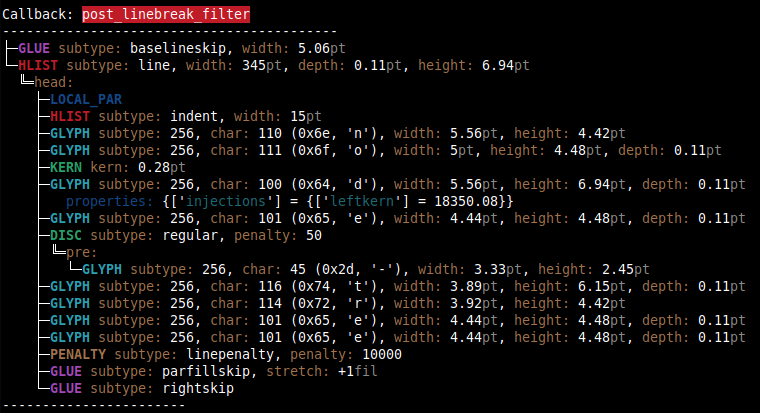

# Abstract

`nodetree` is a development package that visualizes the structure of
node lists. `nodetree` shows its debug informations in the consoles’
output when you compile a LuaTeX file. It uses a similar visual
representation for node lists as the UNIX `tree` command uses for a
folder structure.

Node lists are the main building blocks of each document generated by
the TeX engine LuaTeX. The package `nodetree` doesn‘t change
the rendered document. The tree view can only be seen when using a
terminal to generate the document.

`nodetree` is inspired by a
[gist from Patrick Gundlach](https://gist.github.com/pgundlach/556247).

# License

Copyright (C) 2016 by Josef Friedrich <josef@friedrich.rocks>
------------------------------------------------------------------------
This work may be distributed and/or modified under the conditions of
the LaTeX Project Public License, either version 1.3 of this license
or (at your option) any later version.  The latest version of this
license is in:

  http://www.latex-project.org/lppl.txt

and version 1.3 or later is part of all distributions of LaTeX
version 2005/12/01 or later.

# CTAN

Since July 2016 the cloze package is included in the Comprehensive TeX
Archive Network (CTAN).

* TeX archive: http://mirror.ctan.org/tex-archive/macros/luatex/generic/nodetree
* Package page: http://www.ctan.org/pkg/nodetree

# Repository

https://github.com/Josef-Friedrich/nodetree

# Installation

Get source:

    git clone git@github.com:Josef-Friedrich/nodetree.git
    cd nodetree

Compile:

    make

or manually:

    luatex nodetree.ins
    lualatex nodetree.dtx
    makeindex -s gglo.ist -o nodetree.gls nodetree.glo
    makeindex -s gind.ist -o nodetree.ind nodetree.idx
    lualatex nodetree.dtx

# Examples

## The node list of the package name

```latex
\documentclass{article}
\usepackage{nodetree}
\begin{document}
nodetree
\end{document}
```



## The node list of a mathematical formula

```latex
\documentclass{article}
\usepackage[callback={mhlist}]{nodetree}
\begin{document}
\[\left(a\right)\left[\frac{b}{a}\right]=a\,\]
\end{document}
```


## The node list of the word 'Office'

The characters 'ffi' are deeply nested in a discretionary node.

```latex
\documentclass{article}
\usepackage{nodetree}
\begin{document}
Office
\end{document}
```


