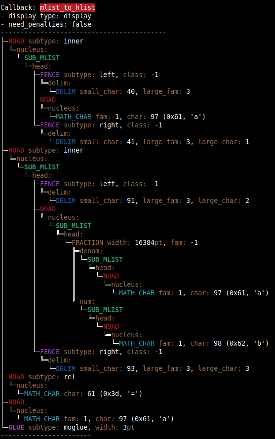
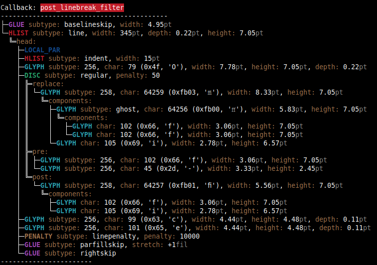

# Abstract

`nodetree` is a development package that visualizes the structure of
node lists. `nodetree` shows its debug informations in the consoles’
output when you compile a LuaTeX file. It uses a similar visual
representation for node lists as the UNIX `tree` command uses for a
folder structure.

Node lists are the main building blocks of each document generated by
the TeX engine LuaTeX. The package `nodetree` doesn‘t change
the rendered document. The tree view can only be seen when using a
terminal to generate the document.

Inspired by a [gist from Patrick Gundlach](https://gist.github.com/pgundlach/556247).

# Examples

